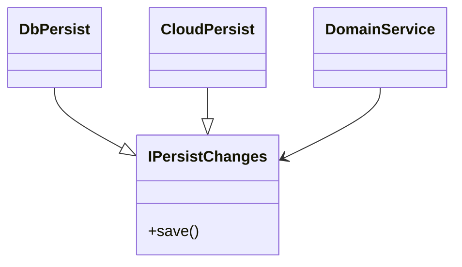

Got some good content, but it's a bit scattered. Need to redevelop the ideas with a new outline.

### _What are the points I want to make?_
- This exercise was helpful in shining light on a problem in C#: how to handle return-value forms of various kinds.
  - Intro to how this came up.
  - Entry point: error handling.
  - Overall, being deliberate about the code we write.
- Introduction/level-set: break down error categories/severity.
- What DU appears to do really well, for errors and other union-type returns.
- exploring C# return-value idioms: what's in the toolbox
  - compare here, or later?
- Conclusion
- when DU might be good to use for return-values
- how the C# idioms compare. Are they stronger? How do they fall short?
- Circling back to `OneOf<>` specifically
  - type ordering
  - is it ever necessary?
  - when would it really shine? (if it would?)

----
I recently reviewed a small project led by a teammate who is on fire for functional programming, with the zeal of a neophyte among heathens in a heathen land (read: F# fanboi in C# shop).

Since the work was fairly deep but constrained within a contiguous part of the codebase, he asked and I allowed him to try out the [`OneOf<>` library](https://github.com/mcintyre321/OneOf). Despite the [limitations we read about](https://matteland.medium.com/oneof-discriminated-unions-in-c-132e534bda99) I thought it would be interesting to see what he came up with, both on `OneOf<..>`'s own terms but also in exploring discriminated unions (**DU**s) more generally.

**NB**: The main usage we explored with `OneOf<..>` was for return values. Other possible usages aren't really considered here.

# Ordering - `OneOf<>`-specific

First a kind of obvious thing: the order-dependence of the types in `OneOf<..>` means it is very helpful if you establish a ordering-pattern early on. I suggested the "least-to-most happy" ordering, e.g. `OneOf<YuckyError, NotFound, ActualValue>`.

This allows for sucessive short-circuit handling blocks with `TryPickT0(out var badOutcome, out var remainingOutcomes)`. It still isn't very pretty though.

And unfortunately, this is a bit of a red herring. DUs will shine where you have multiple possible _successful_ return types that will have different handling in the consuming method. That will call for a different ordering-pattern. Perhaps "general-to-specific"? But what if they are peer-types?

(Or is that itself a red herring?)

Either way, the limitations of the project itself (mainly a port of existing backend-automation code) did not lend itself to deeper exploration of the question. The goal was mainly to use `OneOf<..>` to replace existing error handling, though I do explore other return-usage as thought experiments below.

# Error handling highlights

Even though my teammate was entering into the problem from an overzealous position ("exceptions are just glorified `GOTO`s") this is area in which C# has suffered from lack of clarity. Linguistically and historically, C# exceptions tend to paper over some important distinctions. For a long time overuse was subtly encouraged ([remember `ApplicationException`](https://stackoverflow.com/questions/5685923/what-is-applicationexception-for-in-net)?). Guidance discouraging exceptions for logical flow came along fairly quickly, but then options ran short for returning state and results from `async` methods. It was five years before tuples were normalized into the framework(s) and language. As we'll see below, the sitation is somewhat better today.

It should also be noted that DUs still require judicious use. They are very expressive, but can be overused themselves.

## Error levels!

This experience did bring new light to the distinction between application errors and system errors. This is one of those areas where framework designers themselves tried to make a clean distinction and failed .

.

.

.

But even with new guidance (derive from `System.Exception`; define your own app-error exception base class) there's the sneaking suspicion that applications shouldn't _need_ the expense of the exception mechanism for errors that aren't really... exceptional.

.

.

.

So what error "levels" are there? This is a probably-incomplete list, from bare metal upward:

- **System errors** that we can do nothing about: memory corruption, illegal stack frame access, out-of-bounds memory access. These likely win your process a one-way ticket to SIGKILL. Or maybe someone just tripped over a power cord.
- **Environmental errors** that are out of our control: hard I/O, out-of-memory (which maybe belongs above), HTTP or DB connection timeouts. You may be able to log, it may or may not mean the end of your process, and might be open to retry.
- **Code errors** (look in the mirror). These come in two flavors.
  - **Domain-level errors**: null-ref, arg-null, `ArgumentException`, overflows (numeric or stack). Some of these may even be intentionally composed and thrown by our code, but even then only as a guard against other poorly written code that didn't properly guard its own inputs. _And it's usually our own poorly written code._ You know you've done it. Bow your heads. _Mea culpa, mea culpa, mea maxima culpa._
  - **Infrastructure errors**: API call errors (`400` mainly; `404` is _not_ an error), database errors. These are still our own fault, but because they involve references to other "living" systems there can often be a "historical bad data" (feels like someone else's fault) aspect to them. The path to fixing may be somewhat harder to navigate and have unique catch-22s. These are in a sense true "_application_ errors," as opposed to
- **User input errors**: invalid or otherwise corrupt input. It's our job to catch the bad ones (user's fault) and return a useful message _before_ they cause errors (our fault).
- **Non-error "errors"**: e.g., authn, authz, not-found (`404`). These are only errors in the sense that some user expectation was dashed. From the engineering perspective these outcomes are (or should be) fully expected and accounted for.

The upshot here is that most non-happy path flows that we need to worry about aren't really "exceptional". Maybe half-and-half. There is an existing recommendation that "exceptions should not be used to control logical code flow; they should be used for _exceptional_ circumstances," then we should either be working to **avoid** them (code errors) or simply add them to our flow (validation and non-error).

"Ah ha!," my FP zealot says, "but _that's precisely why_ we need DUs in C# in the first place!!"

But do we?

# Head to Head

At this point we've set the stage. Let's take a look at both systems side-by-side.

## Existing C# Usage & Idioms

"Idioms" in computer languages refer to the ways we use the language to communicate intent in a way that was not explicitly designed into the language. "Idiomatic" usage means ways that are commonly (or organizationally) accepted. They are "patterns" writ small.

The trouble is, as "idioms" they are often subtle and easy to misuse—the same way a human-language learner might trip over difficult idioms in their second language. In a sense, DUs are a language structure that—again [analagous](#foot-1)) to human langage—we might say, "has no equivalent expression in C#."

Nonetheless, the _idioms_ that are available to us allow for some level of logical equvalence, if not equivalence in semantic or resource-usage.

### Just let (true) exceptions happen

.

.

System errors would seem to transcend the language form. Whether or not a language has a means of catching exceptions, there are always some errors for which the only response is external to the executing code. Exception-catching does allow for some of that to be "pulled in" to the process, with a _possibility_ of graceful handling within the executing code.

But how often do you have to handle system errors? All ~~men~~ processes are equal before Death. Both situations may be largely equivalent here. I find it difficult to say that (somehow?) handling a system error in code before catastrophic exit is a significant advantage. This may be just a semantic "potayto, potahto" difference.

Recoverable environmental errors are different though. Let's consider a database connection error in a Clean/Onion/DI architecture scenario. There are two kinds of errors in this case.
1. Unexpected error (e.g., DB connection): the error should be handled either (a) in the persistence layer (e.g., retry) or at the edge of the originating application interaction that caused it (e.g., user request or file ingestion). If it "bubbles out," then the application layer must choose how to contain the failure (fail the request; fail the file; fail only the failed record(s) in the file; panic/die).
2. Domain-expected error (e.g., unknown foreign key reference): the error must be "translated" to an implementation-agnostic form.

In C#, environmental errors such as this are well-established as "exceptional" even in terms of the recommendation above. (They form the boundary-cases of what I would consider "exceptional".) Unless it should be handled at a given level, it can be ignored/bubbled.

In a simple call stack, both have their place. Where it gets interesting is in the indirect case. This will always be the case . But now that we've invoked these, a new discipline is in effect that clarifies the siutation immediately, and makes the situation more clear.

A strict DU handling of (1) requires a translating to a Domain-specific or global "unhandleable" error type option, to be passed on the the domain method. For (2) translate and return the domain-specific error type option. `Task<OneOf<Error, DomainError, Result/None>>`.

Idiomatic C# for (1) will rely on exception-bubbling. For (2) it will require another method. This is where things get [controversial](#foot-2): do we use another exception type, or something different? Our options are limited by `async Task<..>` in this case: we can't fall back on `out` parameters. My (imperfect) preference(s): name the method `Try..(..)` and for
* binary error state (error or no error)
  * with no result: `bool`.
  * with result value: `Result?`.
  * These sufficiently communicate that an "alternate" state may occur. The downside is that it relies on naming convention and/or commentary (xmldoc) to explain the return value.
* multi-error state (one of several possible errors): first, attempt to avoid this. It adds complexity that potentially makes the contract stickier/leakier. But if necessary,
  * with no result: `XxxError` enum.
  * with result: `(XxxError, Result?)` value-tuple.
  * These can also be used to communicate _in code_ what `bool` and `?` cannot.

Which is better? For (1), even with a DU in C#, it doesn't make much sense to wrap/return. The Exception cost has already been paid, and we're risking clutter (although proper "merging" of DU types might allay that). It'll be interesting to see the approach here if DUs do become widely available. Will we start to see red/blue library implementations, some throwing and some returning an error in DU, the same way we saw async/sync? That seems unlikely, and polarizing if attempted.

However for (2) DU has a clear advantage. A DU makes it clear that we're looking for a type that will only be one of (_cough_) these things, and will provide compiler support for ensuring every option will be tested. The semantically tenuous use of the tuple gives up the game, and while it and the enum type allow the logic to work, they have maintainability problems. Notably: what if a new enum value is added in the future? Existing consumers will silently fail, but a new option on a DU would give the compiler pause if it isn't handled everywhere.

### Code errors - also let these fly
`NullReferenceException`, `ArgumentNullException`, `NotSupportedException`, `NotImplementedException`, `ArgumentException`... to consider how to wrap these into DU options is to ask a fundamentally wrong question. All of these aren't so much "errors" or "exceptions" as much as they are "instant bug alerts". They don't indicate exceptional deviation from the Happy Path, they indicate a code path that shouldn't exist at all. If they do occur, the system should fail and fail fast.

Of course, had DUs been in the language from the beginning, some of these _wouldn't_ exist. NREs and ANEs would be impossible in null references didn't exist, and had to be expressed with `Option<RefType>` or `RefType|None`. But then, we may be gaining this imperfectly already, with nullable annotations.

The other form noted above, "infrastructure errors," is more akin to the exception-handling notes [above](#just-let-true-exceptions-happen). These might be "unexpected" at first, but diagnosis may show them to be handlable in code.

### Simple failure: `bool TryXxx(out ...)`
While it relies on naming, this is a tried and true pattern for non-async methods and (unless misused) is not semantically ambiguous.

### Conventional expression: `Result?`
This is effective, and really helpful with nullable annotations. It functions as a logical equivalent to `Result|None`, but lacks the self-documenting power of `None` equivalents like `NotFound`. However, with the addition of a naming conventions like `Try..(): null` → "failure" and `Get..(): null` → "not found" can make a `null` result sufficiently clear.

### Multiple possible types: `ICommonInterface`
This is another logically effective return type for "one of these types," but possibly unsatisfying in the long term. Especially if every variant is meant to be tested for: if another is added, existing consumers may silently fail.

However, "if every variant is meant to be tested," then it is likely that the interface pattern is being misused: ideally, every variant would contain an implementation of the action to be invoked, rather than dead-linking it from the outside.

.

## DUs

### not an exception alternative

This might have been a simple rediscovery of a trivial fact of DU usage: There's really no point in catching system-level exceptions in the interior only to wrap them and pass them back up the call stack. Exception-bubbling is a well-established pattern for that. Whatever expense was involved in `throw`ing and `catch`ing is already paid by that point, so there's no savings.

But note that "system-level" distinction. There are other error types we need to be concerned about.

## Comparisons
"Result or non-binary error" is possible without DU but you lose the advantage of the clear "only one of of these things will be" distinction and the compile-time check that every option is accounted for in the consumer. On the other hand, should that be a thing?

Even without a result, multiple error cases don't get compile-time checks with enums (TODO: or do they? check this)

Finally, there really is no idiom at all for "one of these (non-error) unrelated peer types". However: that should be avoidable with the proper use of a common interface with method(s) whose implementations express the variance in action on consumption.

.

.

.

# Overall Conclusions
...

.

.

.

.

.

----
<a name="foot-1">1</a> "No equivalent expression..." like _mono no aware_ or _Schadenfreude_ in English.

The analogies start to break down of course, because of the organic evolution of natural languages compared to machine "languages". The options for evolving expressions in human language is explosive and virtually limitless, whereas machine language is much more definitively proscribed. Here I would bring in a secondary analogy to thermodynamics: the comparison of infinite energy-state systems to finite systems (e.g., laser cavities). In the former, as energy increases so does entropy. In the latter there is an inflection point where entropy begins to decrease as the system "reorders" itself in the higher state(s). Perhaps there is a point where logical expression in machine language begins to "converge" as well?

Probably not? Even though it is slower, there is still evolution in machine language. They are bound the capabilities of machines, but we humans design them to communicate with each other after all, not the machine. It is an interesting thought though.

<a name="foot-2">2</a> This isn't to say that I'm not papering over a lot of controversy in the DU case. There may be a lot of contention there of which I'm ignorant. I've got more history with C#.
